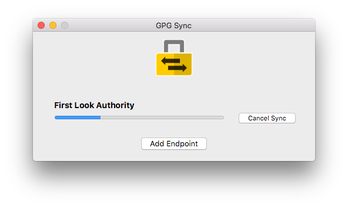

# GPG Sync

GPG Sync is designed to let users always have up-to-date OpenPGP public
keys for other members of their organization.

If you're part of an organization that uses GPG internally you might
notice that it doesn't scale well. New people join and create new keys
and existing people revoke their old keys and transition to new ones.
It quickly becomes unwieldy to ensure that everyone has a copy of everyone
else's current key, and that old revoked keys get refreshed to prevent
users from accidentally using them.

GPG Sync solves this problem by offloading the complexity of GPG to a
single trusted person in your organization. As a member of an organization,
you install GPG Sync on your computer, configure it with a few settings,
and then you forget about it. GPG Sync takes care of everything else.

GPG Sync complies with the in-progress [Distributing OpenPGP Keys with Signed Keylist Subscriptions](https://datatracker.ietf.org/doc/draft-mccain-keylist/)
internet standard draft.

## Learn More

To learn how GPG Sync works and how to use it, check out the [Wiki](https://github.com/firstlookmedia/gpgsync/wiki).

## Getting GPG Sync

To install GPG Sync, follow [these instructions](https://github.com/firstlookmedia/gpgsync/wiki/Installing-GPG-Sync).

## Important note about keyservers

By default, GPG Sync downloads PGP public keys from [keys.openpgp.org](https://keys.openpgp.org/about), a modern abuse-resistent keyserver. (The old SKS keyserver pool is vulnerable to [certificate flooding](https://dkg.fifthhorseman.net/blog/openpgp-certificate-flooding.html) attacks, and it's based on unmaintained software that will likely never get fixed.)

For this reason, **it's important that your authority key, as well as every key on your keylist, has a user ID that contains an email address** and that **all users must opt-in to allowing their email addresses** on this keyserver. You can opt-in by uploading your public key [here](https://keys.openpgp.org/upload), requesting to verify each email address on it, and then clicking the links you receive in those verification emails.

If a member of your organization doesn't opt-in to allowing their email addresses on this keyserver, then when subscribers of your keylist refresh it, the public key that GPG Sync will import won't contain the information necessary to be able to send that member an encrypted email. GPG Sync still supports the legacy, vulnerable SKS keyserver network; this can be enabled in the advanced settings of each keylist.

## Test Status

